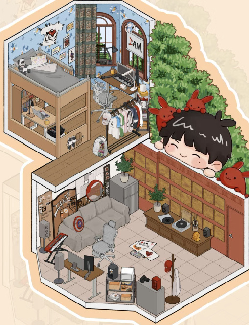
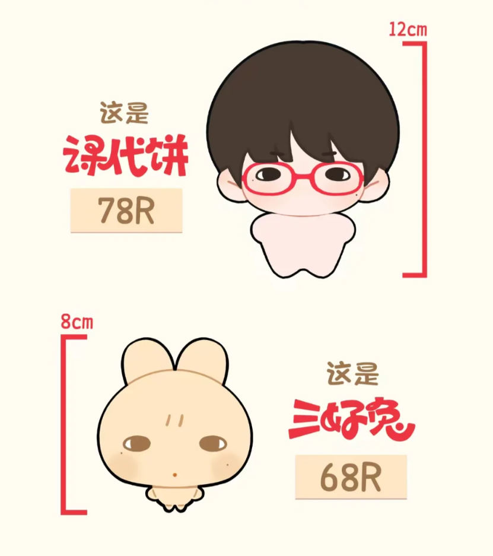
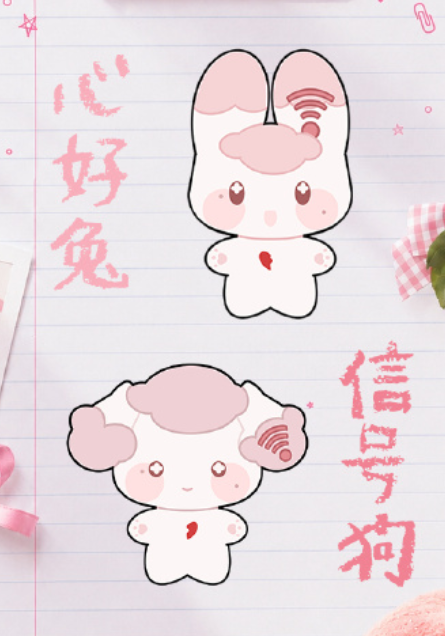
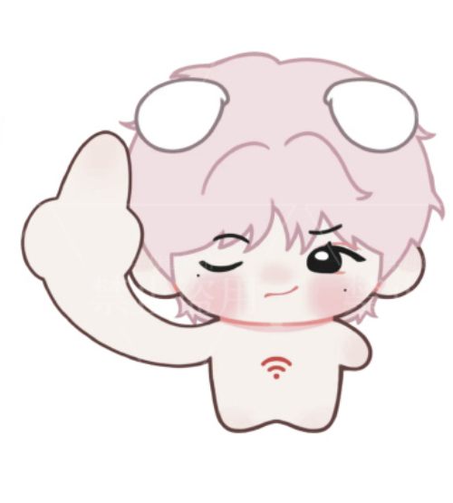
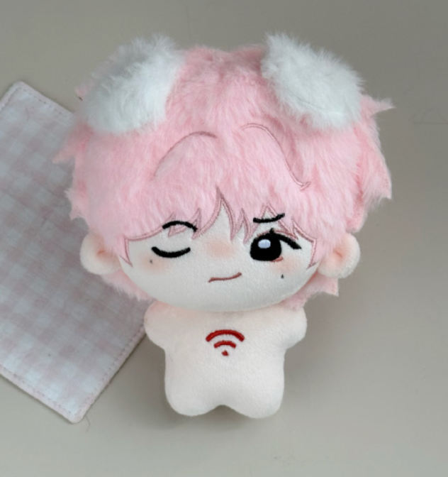

## 目标
复刻游戏“旅行青蛙”，生成尽可能完整、美观、有趣、自洽的粉丝向网页游戏“旅行饼狗”，并部署到我的githubio[https://github.com/emmm1e3m/emmm1e3m.github.io]（我打开了这个链接）上

## 关于饼狗
### 概述

top登陆少年组合成员【苏新皓】的卡通形象，是一只喜欢吃苹果、戴着苹果头套的小狗

### 住所

【铲铲饼屋】
- 床/沙发：饼狗休息的地方
- 电脑：饼狗刷播/冲热的地方
- 衣架：用于后续的换装小游戏“奇迹饼狗”
- 电子琴和唱片机：饼狗休闲娱乐的地方
- 冰箱：消耗货币获取道具
- 下层房间门旁边的展示墙：存放明信片和其它收藏品的地方

### 好友
## 课代饼（人形生物）和三好兔（兔形生物）

## 心好兔（兔形生物）和信号狗（狗形生物）

## 饼哩饼哩（人形生物）

## 技术栈
用你觉得合适的任何技术栈进行开发，但确保游戏本体是一个不用和任何后端通信的页面

## 资源
图标尽可能使用emoji表情、SVG图标等，必要时使用imagegen技能生图（不要为小图标反复生图）

### 明信片（核心收集机制）
https://www.bilibili.com/toy/preview/preview_5SdX8Yet/index.html
这个网站里可以逆向出许多图床链接，包括苏新皓的发在网盘里的日常照片

### 百万直拍
作为饼狗【刷播】活动的产物

https://weibo.com/7760819929?refer_flag=1001030103_
我的浏览器打开了这个链接，已经搜索了含有百万直拍的微博，下载它们的海报，下载最新30个

### 全站第一
作为饼狗【冲热】活动的产物

一共有8个。它们的海报作为收集物。【全站第一】比【百万直拍】更为稀有
有两个全站第一没有海报，BV1cfCSYfEo3和BV1MbZnYoEk1。下载它们的视频封面作为海报

## 存档
每次打开页面时让用户手动上传存档文件（存档文件的后缀改为.bingo），页面左上角的“离开铲铲饼屋（退出游戏回到主界面）按下后自动生成与下载最新的存档文件”
不维护预制的全收集存档；DEBUG 提供“一键全收集”按钮，由当前收藏目录即时生成调试状态
连续按大标题五次输入调试密码“TravellingBingo”解锁调试模式，可设置定时任务的时长之类的

## 游玩
一般饼狗出去玩一趟/刷播/冲热一次的时长是1小时12分钟这个数值。其它道具、时长由你决定。主要货币是苹果🍎。
